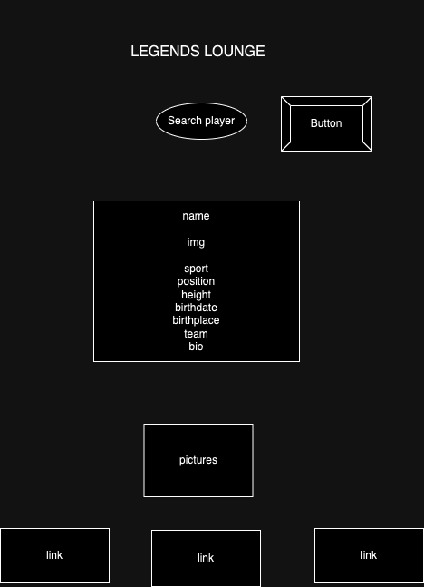

# Legends Lounge

## Description
Legends Lounge is a web application that allows users to search for athletes and view detailed information about them. Utilizing the SportsDB API, users can enter an athlete's name to retrieve data such as their sport, position, height, date of birth, birthplace, team, and even fanart images.

## Features
- **Search** for athletes by name.
- **Display** athlete information, including:
    -   Sport
    -   Position
    -   Height
    -   Date of Birth
    -   Birthplace
    -   Team
    -   Description
    -   View fanart images related to the athlete.
- **Responsive design** for optimal viewing on various devices.

## Installation
- **Clone the repository:**

```git clone https://github.com/AC244/Athlete-API.git```

- **Navigate to the project directory:**

```cd legends-lounge```

- Open index.html in your preferred web browser.

## Usage
- Enter an athlete's name in the input field.
- Click the "GO" button or press "Enter" to retrieve the athlete's information.
- The results will be displayed below the input field.

### Code Snippets

### HTML Structure:

```<input type="text" id="input" placeholder="Enter Athlete">
<button class="arrowButton"></button>
<div id="playerName"></div>
```

### Fetching Player Data:

```const getPlayer = async (name) => {
    try {
        let response = await axios.get(`https://www.thesportsdb.com/api/v1/json/3/searchplayers.php?p=${name}`);
        const playerData = response.data.player;
        // Process and display player data...
    } catch (error) {
        console.error('Error fetching player data:', error);
    }
};
```

### Styling with CSS:

``` body {
    font-family: "Fondamento";
    background-color: #000000;
}

.container {
    text-align: center;
    margin-top: 50px;
}

input {
    width: 200px;
    padding: 15px;
    border-radius: 100%;
    background-color: rgb(227, 253, 253, 0.7);
}
```

## Dependencies
- Axios for making HTTP requests to the SportsDB API.

## API Used
- TheSportsDB API to fetch athlete data.

